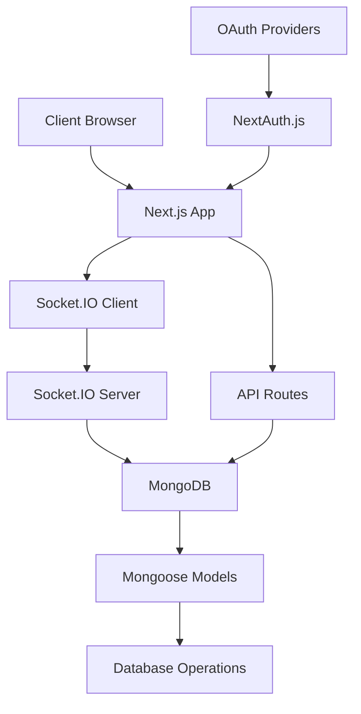

# 🛠 Development Guide

This guide provides detailed information for developers who want to contribute to the WebWizard chat application.

---

## 📋 Table of Contents

- [Development Setup](#development-setup)
- [Project Architecture](#project-architecture)
- [Coding Standards](#coding-standards)
- [Component Development](#component-development)
- [API Development](#api-development)
- [Socket.IO Events](#socketio-events)
- [Database Operations](#database-operations)
- [Testing Guidelines](#testing-guidelines)
- [Deployment Process](#deployment-process)

---

## 🚀 Development Setup

### Prerequisites
-  Node.js 18 or higher
-  MongoDB 6.0+
-  Git
- Code editor (VS Code recommended)

### Environment Setup

1. **Clone and Install**
   ```bash
   git clone <repository-url>
   cd webwizard
   npm install
   ```

2. **Environment Configuration**
   ```bash
   cp .env.example .env.local
   ```

3. **OAuth Setup**
   - Create GitHub OAuth App: https://github.com/settings/applications/new
   - Create Google OAuth App: https://console.developers.google.com/
   - Add credentials to `.env.local`

4. **Database Setup**
   ```bash
   # Local MongoDB
   mongosh
   use webwizard
   
   # Or use MongoDB Atlas connection string
   ```

5. **Development Servers**
   ```bash
   # Terminal 1: Socket.IO Server
   npm run backend
   
   # Terminal 2: Next.js Development Server
   npm run dev
   ```

---

## 🏗 Project Architecture

### Directory Structure
```
webwizard/
├── 📁 app/                          # Next.js App Router
│   ├── 📁 api/                      # API Routes
│   │   ├── 📁 auth/                 # Authentication
│   │   │   ├── [...nextauth]/       # NextAuth.js config
│   │   │   └── me/                  # User info endpoint
│   │   ├── 📁 chatrooms/            # Room management
│   │   │   ├── [id]/                # Room-specific endpoints
│   │   │   │   ├── participants/    # Participant management
│   │   │   │   ├── info/            # Room information
│   │   │   │   └── messages/        # Room messages
│   │   │   ├── join/                # Join room endpoint
│   │   │   └── route.js             # Room CRUD operations
│   │   └── 📁 messages/             # Message management
│   │       ├── [roomId]/            # Room messages
│   │       ├── edit/                # Message editing
│   │       └── file/                # File handling
│   ├── 📁 dashboard/                # Chat dashboard page
│   ├── 📁 login/                    # Authentication page
│   ├── favicon.ico                  # App icon
│   ├── globals.css                  # Global styles
│   ├── layout.js                    # Root layout
│   └── page.js                      # Home page
├── 📁 backend/                      # Socket.IO Server
│   ├── actions.js                   # Database operations
│   └── server.mjs                   # Socket server
├── 📁 components/                   # React Components
│   ├── 📁 chat/                     # Chat components
│   │   ├── ChatProvider.jsx         # Chat context
│   │   ├── ChatWindow.jsx           # Main chat interface
│   │   ├── RoomList.jsx             # Room management
│   │   └── JoinRoomForm.jsx         # Room joining
│   ├── 📁 ui/                       # UI components
│   │   ├── demo.jsx                 # Demo component
│   │   ├── hero-shader.jsx          # Landing page shader
│   │   └── login-1.jsx              # Login form
│   ├── AuthProvider.jsx             # Auth context
│   ├── SessionWrapper.js            # Session provider
│   ├── navbar.jsx                   # Navigation
│   ├── footer.jsx                   # Footer
│   └── ToastTest.jsx                # Toast testing
├── 📁 db/                          # Database config
│   └── connectDB.mjs                # MongoDB connection
├── 📁 models/                      # Mongoose schemas
│   ├── user.js                      # User model
│   └── chatRoom.js                  # ChatRoom model
├── 📁 public/                      # Static assets
└── Configuration files              # Config files
```

### Data Flow Architecture



---

## 📝 Coding Standards

### JavaScript/JSX Conventions

#### Component Structure
```jsx
"use client"; // For client components

import React, { useState, useEffect } from 'react';
import { motion } from 'framer-motion';

/**
 * Component description
 * @param {Object} props - Component props
 * @param {string} props.title - Component title
 */
export default function ComponentName({ title, children }) {
  const [state, setState] = useState(null);

  useEffect(() => {
    // Effect logic
  }, []);

  const handleAction = () => {
    // Event handler logic
  };

  return (
    <motion.div 
      className="component-container"
      initial={{ opacity: 0 }}
      animate={{ opacity: 1 }}
    >
      <h1>{title}</h1>
      {children}
    </motion.div>
  );
}
```

#### Naming Conventions
- **Components**: PascalCase (`ChatWindow.jsx`)
- **Functions**: camelCase (`handleMessage`)
- **Variables**: camelCase (`userList`)
- **Constants**: UPPER_SNAKE_CASE (`API_ENDPOINT`)
- **CSS Classes**: kebab-case (`chat-window`)

#### File Organization
```
ComponentName/
├── ComponentName.jsx        # Main component
├── ComponentName.test.js    # Tests
├── ComponentName.module.css # Styles (if needed)
└── index.js                # Barrel export
```

### CSS/Tailwind Standards

#### Class Organization
```jsx
// Order: Layout -> Spacing -> Typography -> Colors -> States
<div className="flex flex-col w-full h-screen p-4 text-lg font-medium text-white bg-gray-900 hover:bg-gray-800 focus:ring-2">
```

#### Custom Utilities
```css
/* globals.css */
@tailwind base;
@tailwind components;
@tailwind utilities;

@layer components {
  .chat-message {
    @apply flex space-x-3 p-3 rounded-lg bg-gray-800/30;
  }
  
  .toast-success {
    @apply bg-green-500 text-white font-medium;
  }
}
```

---

## 🧩 Component Development

### Chat Components

#### ChatProvider Context
```jsx
// Global chat state management
const ChatContext = createContext(null);

export function ChatProvider({ children }) {
  const [connected, setConnected] = useState(false);
  const [rooms, setRooms] = useState({});
  const [activeRoom, setActiveRoom] = useState(null);
  
  // Socket.IO connection logic
  // Room management logic
  // Message handling logic
  
  return (
    <ChatContext.Provider value={{
      connected,
      rooms,
      activeRoom,
      // ... other values
    }}>
      {children}
    </ChatContext.Provider>
  );
}
```

#### Component Guidelines
1. **Single Responsibility**: Each component has one clear purpose
2. **Props Validation**: Use PropTypes or TypeScript
3. **Error Boundaries**: Wrap components in error boundaries
4. **Accessibility**: Include ARIA labels and keyboard navigation
5. **Performance**: Use React.memo for expensive renders

### UI Components

#### Reusable Button Component
```jsx
import { forwardRef } from 'react';
import { cn } from '@/lib/utils';

const Button = forwardRef(({ 
  className, 
  variant = 'default', 
  size = 'default',
  children,
  ...props 
}, ref) => {
  return (
    <button
      className={cn(
        'inline-flex items-center justify-center rounded-md font-medium transition-colors',
        {
          'bg-primary text-primary-foreground hover:bg-primary/90': variant === 'default',
          'bg-destructive text-destructive-foreground hover:bg-destructive/90': variant === 'destructive',
        },
        {
          'h-10 px-4 py-2': size === 'default',
          'h-9 rounded-md px-3': size === 'sm',
        },
        className
      )}
      ref={ref}
      {...props}
    >
      {children}
    </button>
  );
});

Button.displayName = 'Button';
export { Button };
```

---

## 🔗 API Development

### API Route Structure
```javascript
// app/api/example/route.js
import { NextRequest, NextResponse } from 'next/server';
import { getServerSession } from 'next-auth';
import { authOptions } from '../auth/[...nextauth]/route';
import connectDB from '@/db/connectDB.mjs';

export async function GET(request) {
  try {
    // Authentication check
    const session = await getServerSession(authOptions);
    if (!session) {
      return NextResponse.json({ error: 'Unauthorized' }, { status: 401 });
    }

    // Database connection
    await connectDB();

    // Business logic
    const data = await performOperation();

    return NextResponse.json({ data });
  } catch (error) {
    console.error('API Error:', error);
    return NextResponse.json(
      { error: 'Internal Server Error' }, 
      { status: 500 }
    );
  }
}

export async function POST(request) {
  try {
    const session = await getServerSession(authOptions);
    if (!session) {
      return NextResponse.json({ error: 'Unauthorized' }, { status: 401 });
    }

    const body = await request.json();
    
    // Validation
    if (!body.requiredField) {
      return NextResponse.json(
        { error: 'Missing required field' }, 
        { status: 400 }
      );
    }

    await connectDB();
    const result = await createResource(body);

    return NextResponse.json({ result }, { status: 201 });
  } catch (error) {
    console.error('API Error:', error);
    return NextResponse.json(
      { error: 'Internal Server Error' }, 
      { status: 500 }
    );
  }
}
```

### Error Handling
```javascript
// lib/api-error.js
export class APIError extends Error {
  constructor(message, statusCode = 500) {
    super(message);
    this.statusCode = statusCode;
  }
}

export function handleAPIError(error) {
  if (error instanceof APIError) {
    return NextResponse.json(
      { error: error.message }, 
      { status: error.statusCode }
    );
  }
  
  console.error('Unexpected error:', error);
  return NextResponse.json(
    { error: 'Internal Server Error' }, 
    { status: 500 }
  );
}
```

---

## ⚡ Socket.IO Events

### Server-Side Event Handling
```javascript
// backend/server.mjs
import { Server } from 'socket.io';

const io = new Server(server, {
  cors: {
    origin: process.env.FRONTEND_URL,
    methods: ['GET', 'POST']
  }
});

io.on('connection', (socket) => {
  console.log('User connected:', socket.id);

  // Authentication middleware
  socket.use(async (packet, next) => {
    try {
      const token = packet[1]?.token;
      const user = await verifyToken(token);
      socket.user = user;
      next();
    } catch (error) {
      next(new Error('Authentication failed'));
    }
  });

  // Event handlers
  socket.on('joinRoom', async ({ roomId, password }) => {
    try {
      const room = await joinRoom(socket.user.id, roomId, password);
      socket.join(roomId);
      
      // Notify room members
      socket.to(roomId).emit('userJoined', {
        user: socket.user,
        roomId
      });
      
      socket.emit('roomJoined', { room });
    } catch (error) {
      socket.emit('error', { message: error.message });
    }
  });

  socket.on('newMessage', async ({ roomId, text, type }) => {
    try {
      const message = await createMessage({
        sender: socket.user.id,
        roomId,
        text,
        type
      });

      // Broadcast to room
      io.to(roomId).emit('message', message);
    } catch (error) {
      socket.emit('error', { message: error.message });
    }
  });

  socket.on('disconnect', () => {
    console.log('User disconnected:', socket.id);
    // Cleanup logic
  });
});
```

### Client-Side Event Handling
```javascript
// components/chat/ChatProvider.jsx
useEffect(() => {
  if (!socket) return;

  const handleMessage = (message) => {
    setRooms(prev => ({
      ...prev,
      [message.roomId]: {
        ...prev[message.roomId],
        messages: [...(prev[message.roomId]?.messages || []), message]
      }
    }));

    // Show toast notification
    if (message.sender.username !== user?.username) {
      toast(`New message from ${message.sender.username}`, {
        duration: 2000,
        style: { background: '#3B82F6', color: '#fff' }
      });
    }
  };

  socket.on('message', handleMessage);
  return () => socket.off('message', handleMessage);
}, [socket, user]);
```

---

## 🗄 Database Operations

### Mongoose Model Example
```javascript
// models/chatRoom.js
import mongoose from 'mongoose';

const chatRoomSchema = new mongoose.Schema({
  name: {
    type: String,
    required: true,
    trim: true,
    maxLength: 100
  },
  roomId: {
    type: String,
    required: true,
    unique: true,
    index: true
  },
  isPrivate: {
    type: Boolean,
    default: false
  },
  password: {
    type: String,
    select: false // Don't include in queries by default
  },
  participants: [{
    type: mongoose.Schema.Types.ObjectId,
    ref: 'User'
  }],
  createdBy: {
    type: mongoose.Schema.Types.ObjectId,
    ref: 'User',
    required: true
  },
  lastActivity: {
    type: Date,
    default: Date.now
  }
}, {
  timestamps: true
});

// Indexes
chatRoomSchema.index({ createdBy: 1, createdAt: -1 });
chatRoomSchema.index({ participants: 1 });

// Middleware
chatRoomSchema.pre('save', async function(next) {
  if (this.isModified('password') && this.password) {
    this.password = await bcrypt.hash(this.password, 12);
  }
  next();
});

// Methods
chatRoomSchema.methods.checkPassword = async function(password) {
  return await bcrypt.compare(password, this.password);
};

export default mongoose.models.ChatRoom || mongoose.model('ChatRoom', chatRoomSchema);
```

### Database Operations
```javascript
// backend/actions.js
export async function createChatRoom({ name, isPrivate, password, createdBy }) {
  await connectDB();
  
  const roomId = generateRoomId();
  
  const room = new ChatRoom({
    name,
    roomId,
    isPrivate,
    password: isPrivate ? password : undefined,
    createdBy,
    participants: [createdBy]
  });
  
  await room.save();
  return room.populate('participants', 'name username email');
}

export async function getMessagesForRoom(roomId, limit = 50, offset = 0) {
  await connectDB();
  
  const messages = await Message
    .find({ roomId })
    .populate('sender', 'name username email')
    .sort({ createdAt: -1 })
    .limit(limit)
    .skip(offset)
    .lean();
    
  return messages.reverse();
}
```

---

## 🧪 Testing Guidelines

### Component Testing
```javascript
// components/chat/__tests__/ChatWindow.test.jsx
import { render, screen, fireEvent, waitFor } from '@testing-library/react';
import { ChatProvider } from '../ChatProvider';
import ChatWindow from '../ChatWindow';

const mockRoom = {
  id: 'test-room',
  name: 'Test Room',
  participants: []
};

describe('ChatWindow', () => {
  const renderWithProvider = (props = {}) => {
    return render(
      <ChatProvider>
        <ChatWindow room={mockRoom} {...props} />
      </ChatProvider>
    );
  };

  test('renders chat window with room name', () => {
    renderWithProvider();
    expect(screen.getByText('Test Room')).toBeInTheDocument();
  });

  test('sends message on form submission', async () => {
    renderWithProvider();
    
    const input = screen.getByPlaceholderText('Type a message...');
    const submitButton = screen.getByRole('button', { name: /send/i });
    
    fireEvent.change(input, { target: { value: 'Hello, world!' } });
    fireEvent.click(submitButton);
    
    await waitFor(() => {
      expect(input.value).toBe('');
    });
  });
});
```

### API Testing
```javascript
// __tests__/api/chatrooms.test.js
import { createMocks } from 'node-mocks-http';
import handler from '../app/api/chatrooms/route';

describe('/api/chatrooms', () => {
  test('GET returns user rooms', async () => {
    const { req, res } = createMocks({
      method: 'GET',
      headers: {
        'authorization': 'Bearer valid-token'
      }
    });

    await handler(req, res);

    expect(res._getStatusCode()).toBe(200);
    expect(JSON.parse(res._getData())).toHaveProperty('rooms');
  });

  test('POST creates new room', async () => {
    const { req, res } = createMocks({
      method: 'POST',
      headers: {
        'authorization': 'Bearer valid-token',
        'content-type': 'application/json'
      },
      body: {
        name: 'New Room',
        isPrivate: false
      }
    });

    await handler(req, res);

    expect(res._getStatusCode()).toBe(201);
    expect(JSON.parse(res._getData())).toHaveProperty('room');
  });
});
```

---

## 🚀 Deployment Process

### Production Build
```bash
# Build the application
npm run build

# Start production server
npm start
```

### Environment Variables
```bash
# Production .env
NODE_ENV=production
NEXTAUTH_URL=https://your-domain.com
MONGODB_URI=mongodb+srv://...
# ... other production variables
```

### Docker Deployment
```dockerfile
# Dockerfile
FROM node:18-alpine AS base

WORKDIR /app
COPY package*.json ./
RUN npm ci --only=production

FROM base AS build
RUN npm ci
COPY . .
RUN npm run build

FROM base AS runtime
COPY --from=build /app/.next ./.next
COPY --from=build /app/public ./public
COPY --from=build /app/package.json ./package.json

EXPOSE 3000
CMD ["npm", "start"]
```

### CI/CD Pipeline
```yaml
# .github/workflows/deploy.yml
name: Deploy to Production

on:
  push:
    branches: [main]

jobs:
  deploy:
    runs-on: ubuntu-latest
    steps:
      - uses: actions/checkout@v3
      - uses: actions/setup-node@v3
        with:
          node-version: '18'
      - run: npm ci
      - run: npm run build
      - run: npm test
      - name: Deploy
        run: |
          # Deployment commands
```

---

## 📚 Additional Resources

### Documentation Links
- [Next.js Documentation](https://nextjs.org/docs)
- [Socket.IO Documentation](https://socket.io/docs/)
- [MongoDB Documentation](https://docs.mongodb.com/)
- [Tailwind CSS Documentation](https://tailwindcss.com/docs)
- [NextAuth.js Documentation](https://next-auth.js.org/)

### Development Tools
- **VS Code Extensions**: ES7+ React/Redux/React-Native snippets, Tailwind CSS IntelliSense
- **Browser Extensions**: React Developer Tools, Redux DevTools
- **Testing Tools**: Jest, React Testing Library, Cypress
- **Linting**: ESLint, Prettier, Husky

---

<div align="center">

**Happy Coding! 🚀**

For questions or support, create an issue or contact the development team.

</div>