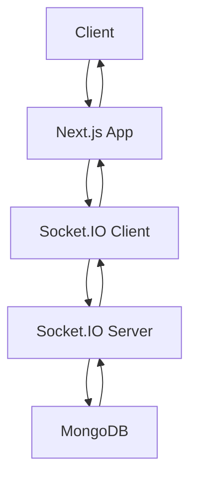

# 🚀 WebWizard - Real-Time Chat Application

<div align="center">


**A modern, real-time chat application built with Next.js 15, Socket.IO, and MongoDB**

[Live Demo](#) • [Features](#features) • [Installation](#installation) • [Documentation](#documentation)

</div>

---

## 📋 Table of Contents

- [Overview](#overview)
- [Features](#features)
- [Tech Stack](#tech-stack)
- [Architecture](#architecture)
- [Installation & Setup](#installation--setup)
- [Environment Variables](#environment-variables)
- [API Documentation](#api-documentation)
- [Components Overview](#components-overview)
- [Real-Time Features](#real-time-features)
- [Authentication](#authentication)
- [Database Schema](#database-schema)
- [Deployment](#deployment)
- [Contributing](#contributing)

---

## 🎯 Overview

WebWizard is a feature-rich, real-time chat application that enables users to create public and private chat rooms, send messages instantly, and interact with other users in real-time. Built with modern web technologies, it provides a seamless and responsive user experience with advanced features like typing indicators, user presence, and toast notifications.

### Key Highlights

- ⚡ **Real-time messaging** with Socket.IO
- 🔐 **Secure authentication** with NextAuth.js
- 🎨 **Modern UI** with Tailwind CSS and Framer Motion
- 📱 **Responsive design** for all devices
- 🌙 **Dark theme** optimized interface
- 🔔 **Toast notifications** for user interactions
- 👥 **User presence** and typing indicators
- 🏠 **Public & Private rooms** with password protection

---

## ✨ Features

### 🚀 Core Features
- **Real-time Messaging**: Instant message delivery using Socket.IO
- **User Authentication**: Secure login with GitHub and Google OAuth
- **Room Management**: Create, join, and leave chat rooms
- **Public & Private Rooms**: Support for both public and password-protected rooms
- **Message History**: Persistent message storage with MongoDB
- **User Profiles**: Display user information and avatars

### 🎨 User Experience
- **Typing Indicators**: See when other users are typing
- **Toast Notifications**: Real-time notifications for joins, leaves, and messages
- **Responsive Design**: Optimized for desktop, tablet, and mobile
- **Dark Theme**: Eye-friendly dark interface
- **Smooth Animations**: Framer Motion powered transitions
- **Custom Scrollbars**: Enhanced UI with custom styled scrollbars

### 🔧 Advanced Features
- **Participant Panel**: View active users in each room
- **Room Information**: Display room details and participant count
- **Message Validation**: Input sanitization and validation
- **Error Handling**: Comprehensive error management
- **Browser Notifications**: Native browser notification support
- **Session Management**: Secure session handling with JWT

---

## 🛠 Tech Stack

### Frontend
| Technology | Version | Purpose |
|------------|---------|---------|
|  | 15.5.4 | React framework with App Router |
|  | 19.1.0 | UI library |
|  | 4.0 | Utility-first CSS framework |
|  | 12.23.22 | Animation library |
|  | 4.8.1 | Real-time communication |

### Backend
| Technology | Version | Purpose |
|------------|---------|---------|
|  | Latest | Runtime environment |
|  | 4.19.2 | Web framework |
|  | 4.8.1 | WebSocket server |
|  | 6.20.0 | Database driver |
|  | 8.18.2 | ODM for MongoDB |

### Authentication
| Technology | Version | Purpose |
|------------|---------|---------|
|  | 4.24.11 | Authentication library |
|  | 9.0.2 | Token management |
|  | 2.4.3 | Password hashing |

### UI Components
| Technology | Version | Purpose |
|------------|---------|---------|
|  | Latest | Headless UI components |
|  | 0.544.0 | Icon library |
|  | 2.6.0 | Toast notifications |

---

## 🏗 Architecture

### Project Structure
```
webwizard/
├── 📁 app/                          # Next.js App Router
│   ├── 📁 api/                      # API Routes
│   │   ├── 📁 auth/                 # Authentication endpoints
│   │   ├── 📁 chatrooms/            # Chat room management
│   │   └── 📁 messages/             # Message handling
│   ├── 📁 dashboard/                # Dashboard page
│   ├── 📁 login/                    # Login page
│   ├── globals.css                  # Global styles
│   ├── layout.js                    # Root layout
│   └── page.js                      # Home page
├── 📁 backend/                      # Socket.IO Server
│   ├── actions.js                   # Database actions
│   └── server.mjs                   # Socket server
├── 📁 components/                   # React Components
│   ├── 📁 chat/                     # Chat-specific components
│   ├── 📁 ui/                       # Reusable UI components
│   ├── AuthProvider.jsx             # Auth context
│   ├── navbar.jsx                   # Navigation
│   └── footer.jsx                   # Footer
├── 📁 db/                          # Database configuration
├── 📁 models/                      # Mongoose schemas
└── 📁 public/                      # Static assets
```

### Data Flow


---

## 🚀 Installation & Setup

### Prerequisites
-  Node.js 18 or higher
-  MongoDB instance
-  Git

### Step 1: Clone the Repository
```bash
git clone <repository-url>
cd webwizard
```

### Step 2: Install Dependencies
```bash
npm install
```

### Step 3: Environment Setup
Create a `.env.local` file in the root directory:

```env
# Database
MONGODB_URI=mongodb://localhost:27017/webwizard

# NextAuth Configuration
NEXTAUTH_URL=http://localhost:3000
NEXTAUTH_SECRET=your-secret-key-here
JWT_SECRET=your-jwt-secret

# GitHub OAuth
GITHUB_CLIENT_ID=your-github-client-id
GITHUB_CLIENT_SECRET=your-github-client-secret

# Google OAuth
GOOGLE_CLIENT_ID=your-google-client-id
GOOGLE_CLIENT_SECRET=your-google-client-secret

# Socket.IO
SOCKET_SERVER_URL=http://localhost:3001
```

### Step 4: Start the Application

#### Start the Socket.IO Server
```bash
npm run backend
```

#### Start the Next.js Development Server
```bash
npm run dev
```

The application will be available at:
- **Frontend**: http://localhost:3000
- **Socket.IO Server**: http://localhost:3001

---

## 🔐 Environment Variables

| Variable | Description | Required |
|----------|-------------|----------|
| `MONGODB_URI` | MongoDB connection string | ✅ |
| `NEXTAUTH_URL` | Application URL for NextAuth | ✅ |
| `NEXTAUTH_SECRET` | Secret key for NextAuth | ✅ |
| `GITHUB_CLIENT_ID` | GitHub OAuth client ID | ✅ |
| `GITHUB_CLIENT_SECRET` | GitHub OAuth client secret | ✅ |
| `GOOGLE_CLIENT_ID` | Google OAuth client ID | ✅ |
| `GOOGLE_CLIENT_SECRET` | Google OAuth client secret | ✅ |
| `SOCKET_SERVER_URL` | Socket.IO server URL | ✅ |

---

## 📡 API Documentation

### Authentication Endpoints

#### `POST /api/auth/signin`
Authenticate user with OAuth providers.

#### `GET /api/auth/me`
Get current user information.

### Chat Room Endpoints

#### `GET /api/chatrooms`
Get all chat rooms for the authenticated user.

#### `POST /api/chatrooms`
Create a new chat room.

```json
{
  "name": "Room Name",
  "isPrivate": false,
  "password": "optional-password"
}
```

#### `POST /api/chatrooms/join`
Join an existing chat room.

```json
{
  "roomId": "room-id",
  "password": "room-password"
}
```

#### `GET /api/chatrooms/[id]/participants`
Get participants of a specific room.

#### `GET /api/chatrooms/[id]/info`
Get room information.

### Message Endpoints

#### `GET /api/messages/[roomId]`
Get message history for a room.

#### `POST /api/messages/[roomId]`
Send a message to a room.

```json
{
  "text": "Message content",
  "type": "text"
}
```

---

## 🧩 Components Overview

### Core Components

#### `ChatProvider.jsx`
- **Purpose**: Global chat state management
- **Features**: Socket connection, room management, typing indicators
- **Context**: Provides chat functionality to all components

#### `ChatWindow.jsx`
- **Purpose**: Main chat interface
- **Features**: Message display, input handling, participants panel
- **Real-time**: Message updates, typing indicators

#### `RoomList.jsx`
- **Purpose**: Room management interface
- **Features**: Join/leave rooms, room discovery, participant counts

#### `JoinRoomForm.jsx`
- **Purpose**: Room joining interface
- **Features**: Room validation, password handling

### UI Components

#### `Navbar.jsx`
- **Purpose**: Application navigation
- **Features**: User menu, authentication status, responsive design

#### `Footer.jsx`
- **Purpose**: Application footer
- **Features**: Links, branding, responsive layout

### Utility Components

#### `AuthProvider.jsx`
- **Purpose**: Authentication context
- **Features**: Session management, user state

#### `SessionWrapper.js`
- **Purpose**: NextAuth session wrapper
- **Features**: Global session provider

---

## ⚡ Real-Time Features

### Socket.IO Events

#### Client Events
```javascript
// Join a room
socket.emit('joinRoom', { roomId, password });

// Send a message
socket.emit('newMessage', { roomId, text, type });

// Typing indicators
socket.emit('typing', { roomId, isTyping });

// Leave a room
socket.emit('leaveRoom', { roomId });
```

#### Server Events
```javascript
// Receive messages
socket.on('message', (message) => {});

// System notifications
socket.on('system', (data) => {});

// Typing indicators
socket.on('userTyping', (data) => {});

// Room history
socket.on('history', (messages) => {});

// User joined/left
socket.on('roomJoined', (roomData) => {});
```

### Toast Notifications

#### Join Notifications
```javascript
toast.success(`${username} joined the chat`, {
  duration: 3000,
  style: { background: '#10B981', color: '#fff' }
});
```

#### Leave Notifications
```javascript
toast(`${username} left the chat`, {
  duration: 3000,
  style: { background: '#6B7280', color: '#fff' }
});
```

#### Message Notifications
```javascript
toast(`New message from ${username}`, {
  duration: 2000,
  style: { background: '#3B82F6', color: '#fff' }
});
```

---

## 🔒 Authentication

### OAuth Providers

#### GitHub OAuth
```javascript
GitHubProvider({
  clientId: process.env.GITHUB_CLIENT_ID,
  clientSecret: process.env.GITHUB_CLIENT_SECRET,
})
```

#### Google OAuth
```javascript
GoogleProvider({
  clientId: process.env.GOOGLE_CLIENT_ID,
  clientSecret: process.env.GOOGLE_CLIENT_SECRET,
})
```

### Session Management
- **Strategy**: JWT tokens
- **Storage**: HTTP-only cookies
- **Middleware**: Protected API routes
- **Client**: Session hooks and context

---

## 🗄 Database Schema

### User Model
```javascript
{
  name: String,
  email: String,
  image: String,
  username: String,
  createdAt: Date,
  lastLogin: Date
}
```

### ChatRoom Model
```javascript
{
  name: String,
  roomId: String (unique),
  isPrivate: Boolean,
  password: String (hashed),
  participants: [ObjectId],
  createdBy: ObjectId,
  createdAt: Date,
  lastActivity: Date
}
```

### Message Model
```javascript
{
  roomId: String,
  sender: ObjectId,
  text: String,
  type: String,
  createdAt: Date,
  editedAt: Date,
  isEdited: Boolean
}
```

---

## 🎨 Styling & UI

### Tailwind CSS Configuration
- **Version**: 4.0
- **Theme**: Dark-focused design
- **Components**: Custom utility classes
- **Responsive**: Mobile-first approach

### Custom Scrollbars
```css
.scrollbar-thin {
  scrollbar-width: thin;
  scrollbar-color: #374151 transparent;
}
```

### Animation System
- **Library**: Framer Motion
- **Animations**: Page transitions, component mounting
- **Performance**: GPU-accelerated animations

---

## 🚀 Deployment

### Production Build
```bash
npm run build
npm start
```

### Docker Support
```dockerfile
FROM node:18-alpine
WORKDIR /app
COPY package*.json ./
RUN npm ci --only=production
COPY . .
RUN npm run build
EXPOSE 3000
CMD ["npm", "start"]
```

### Environment Setup
- Configure production environment variables
- Set up MongoDB Atlas or self-hosted instance
- Configure OAuth apps for production URLs
- Set up SSL certificates

---

## 🤝 Contributing

### Development Setup
1. Fork the repository
2. Create a feature branch: `git checkout -b feature/new-feature`
3. Make your changes
4. Test thoroughly
5. Commit changes: `git commit -m "Add new feature"`
6. Push to branch: `git push origin feature/new-feature`
7. Open a Pull Request

### Code Standards
- **ESLint**: Configured for Next.js
- **Prettier**: Code formatting
- **Conventions**: Component naming, file structure
- **Testing**: Component and integration tests

---

## 📝 License

This project is licensed under the MIT License - see the [LICENSE](LICENSE) file for details.

---

## 👥 Contributors

- **Developer**: Your Name
- **Design**: UI/UX Team
- **Testing**: QA Team

---

## 🙏 Acknowledgments

- **Next.js Team** for the amazing framework
- **Socket.IO** for real-time capabilities
- **MongoDB** for reliable database solutions
- **Tailwind CSS** for utility-first styling
- **Vercel** for deployment platform

---

<div align="center">

**Built with ❤️ using modern web technologies**


</div>